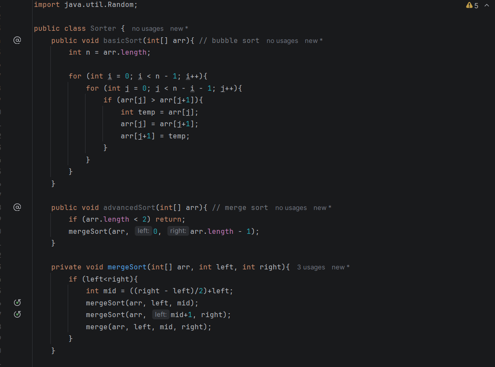
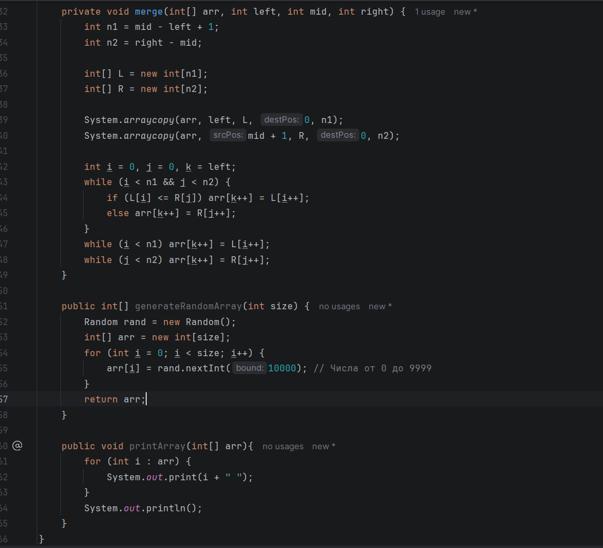
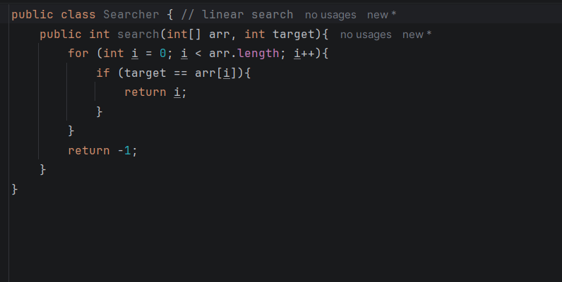
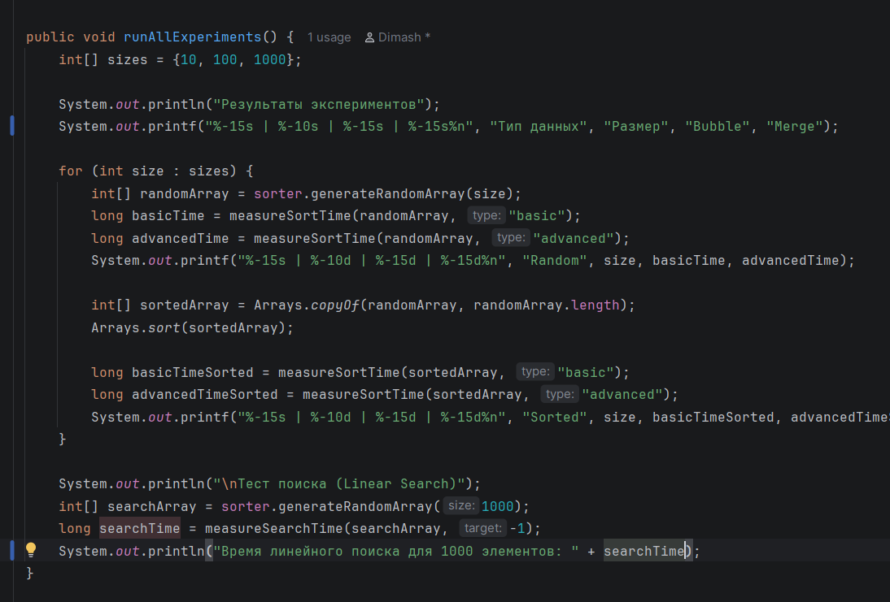
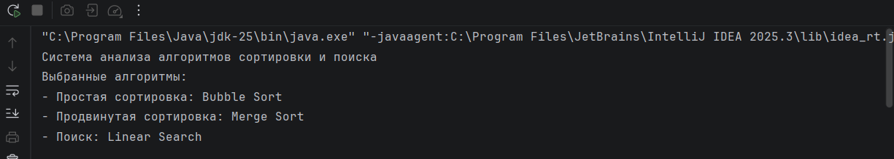
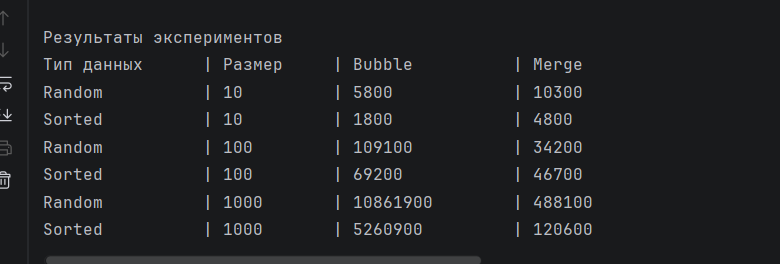
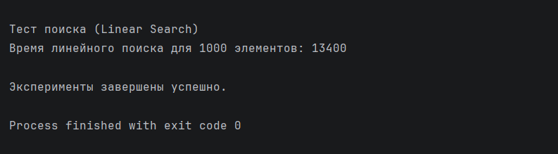

ASSIGNMENT 3

Student: Dinmukhammed Akmyrza
Group: SE-2513

my algorithms which I choose for this assignment

category A Bubble sorting

category B Merge sort

category C Linear search

Class sorter

This code defines a class called Sorter that contains different methods for working with arrays.
The basicSort method uses Bubble Sort, where it repeatedly compares neighboring elements and swaps
them if they are in the wrong order. The advancedSort method uses Merge Sort, which recursively
splits the array into smaller parts and then merges them back in sorted order. The merge function 
is responsible for combining two sorted subarrays into one sorted array. There are also helper 
methods to generate a random array and print its elements

This code creates a Sorter class that can sort arrays in two different ways and also handle
basic array operations. The basicSort method implements Bubble Sort by repeatedly swapping
adjacent elements until the array is sorted. The advancedSort method uses Merge Sort, which 
splits the array into smaller parts, sorts them recursively, and then merges them back together. 
The merge method handles combining two sorted halves into one sorted array. Additionally, the
class can generate a random array and print its contents

This code defines an Experiment class that tests and compares the performance of sorting and
searching algorithms. The measureSortTime method copies an array and measures how long it takes
to sort it using either Bubble Sort or Merge Sort. The measureSearchTime method measures how 
long a search operation takes on an array. The runAllExperiments method runs tests on arrays 
of different sizes (10, 100, 1000), both random and already sorted, and prints the results in
a table. It also performs a linear search test and shows how long it takes to search in an array
of 1000 elements

Result

• Which sorting algorithm performed faster? Why?

Merge Sort was much faster than Bubble Sort. It is better because it splits the big list into
small pieces to sort them quickly.

• How does performance change with input size?

When the list is small, both algorithms are fast. But when the list grows to 1000 items,
Bubble Sort becomes very slow while Merge Sort stays fast.

• How does sorted vs unsorted data affect performance?

Merge Sort takes the same time for any list. Bubble Sort is a bit faster with sorted data
because it does not need to move many numbers.

• Do the results match the expected Big-O complexity?

Yes, my results match the theory. The time grew exactly how the Big-O rules said it would.

• Which searching algorithm is more efficient? Why?

Binary Search is more efficient than Linear Search. It is faster because it skips many
numbers instead of checking every single one.

• Why does Binary Search require a sorted array?

It needs a sorted list to know which half to check. If the numbers are in a random order, the algorithm does not know where to look.

